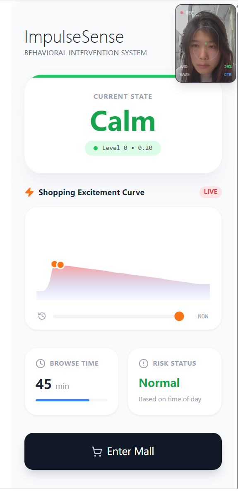
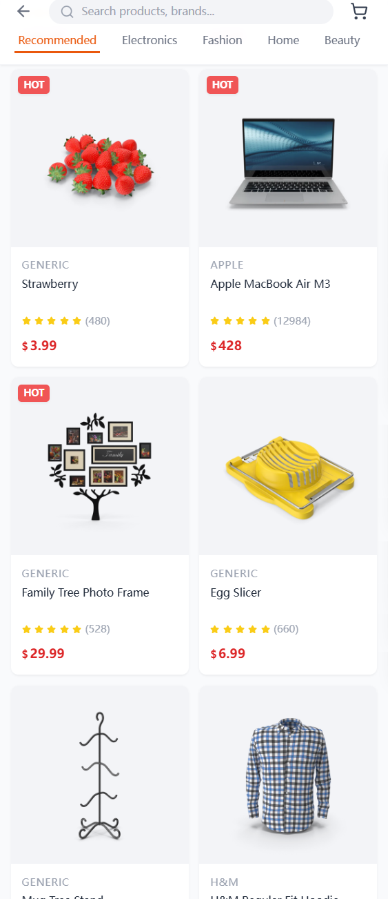
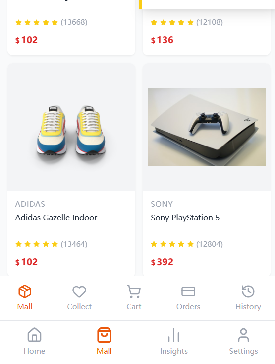
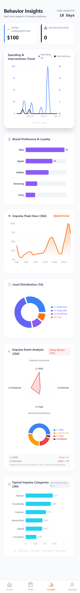
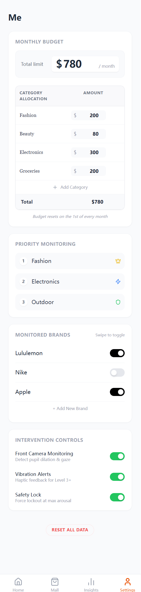

# 📱 ImpulseSense — Emotion-Aware Shopping Intervention (HCI Research Prototype)

> A Human–Computer Interaction prototype for detecting & moderating impulsive buying behavior.  
> Digital well-being / affective computing / multimodal intervention for shopping.

### 🏠 Home Screen


## 🌟 Project Overview
ImpulseSense is built on **Affective Computing** and **HCI intervention models** to simulate real e-commerce (Amazon / Taobao) and monitor, in real time:
- Arousal (emotional activation)
- Impulsiveness
- Behavioral patterns (dwell time, add-to-cart, browsing trajectory)

When impulsive risk is detected, the system provides **multimodal interventions** (prompts, filters, breathing guidance, micro-lock, safe mode, etc.) to help users make more rational decisions and explore digital well-being for healthier consumption.

### 📱 Other App Screens
- **Mall Page 1**: [](image_app/Mall_1.png)
- **Mall Page 2**: [](image_app/Mall_2.png)
- **Insights Page**: [](image_app/Insights.png)
- **Settings Page**: [](image_app/Mesetting.png)

## 📦 What's in V0.1 (Academic Demo)
- Shopping simulation: product feed (Mock APIs), search/category/detail/multi-image, favorite, add-to-cart
- Impulse index (demo): behavior features + context risk, levels L0–L5
- Intervention UI: L1 prompt, L2 gray/blue filter, L3 breathing, L4 micro-lock, L5 30-min safe mode
- Insights: impulse events / level distribution, category preference, peak hours, arousal curves, intervention curves
- Experiment-friendly: demo uses simulated data; core algorithms/data not public; multimodal ready

## 🚀 Quick Start
### Web (Vite + React)
```bash
npm install
npm run dev
# open http://localhost:5173
```

### Expo RN Prototype (unfinished skeleton, runnable)
```bash
cd rn-expo
npm install
npm start          # press w for web preview; scan QR with Expo Go
# if same-network scan fails, use:
npm start --tunnel
```
Notes:
- RN deps: Expo SDK 54 / RN 0.76.5 / React 18.3.1
- `app.json` icon/splash not provided; put assets in `rn-expo/assets/` or adjust config
- First load may be slow; npm warnings (deprecated/peer) are generally safe

## 🔬 Roadmap
- Physiological & emotion modalities: micro-expressions, eye-tracking, swipe-speed pulse, individual baseline model
- Analytics: long-term emotional drift, stimulus–response curves, impulse decision chains
- HCI studies: A/B on intervention levels, interviews/reflection, longitudinal experiments

## 🎓 Collaborations
- Topics: HCI / Affective Computing / Digital Well-being / Persuasive Tech
- Needs: emotion & behavior sensing, intervention UX, impulsive-consumption cognition, lab/field studies, papers (CHI/CSCW/UIST/IMWUT, etc.)
- Contact:  
  - 📧 lvcongrui@m.ldu.edu.cn / rebeccalv647@gmail.com  
  - 🌐 https://github.com/CongruiLyu

## ⚠️ Disclaimer
- Academic prototype, non-commercial  
- No real user data; all mock or simulated

## 📜 License
- Web: if not stated, all rights reserved  
- Expo RN prototype: MIT (see `rn-expo/LICENSE`)
